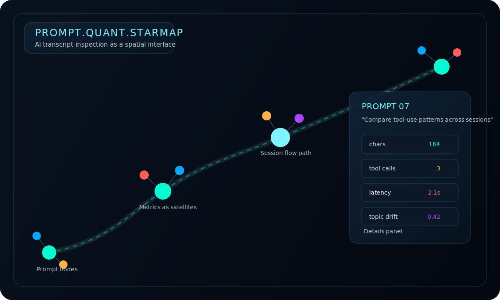
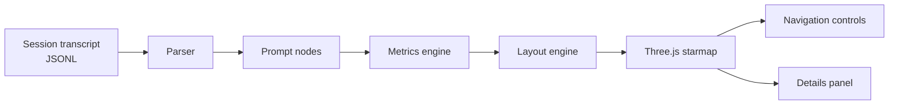

# Prompt Quant Visualizer

## Project Summary

Prompt Quant Visualizer is a browser-based 3D interface for inspecting AI conversation transcripts. It turns prompts, response timing, tool usage, and topic shifts into a navigable starmap so an operator can read session structure at a glance instead of scanning a long log.

## Why This Exists

Most transcript viewers are built for replay. This project explores a different question: what happens when an AI session is treated like a spatial interface instead of a chat window?

The goal is to make operator workflows easier to inspect. A session should show pacing, complexity, drift, and tool activity as visible patterns, not just text in sequence.

## Key Ideas or Features

- Load `.jsonl` transcripts and convert user prompts into navigable nodes.
- Compute prompt metrics including token estimate, latency, tool-call count, topic overlap, and thinking intensity.
- Render the session as a 3D path with glowing nodes, animated links, and metric satellites.
- Open a details panel for the full prompt text, timestamps, and per-node metrics.
- Navigate with keyboard controls, timeline controls, or direct node selection.
- Run as a standalone browser tool with demo data for quick inspection.

## How It Works (High Level)

1. The parser reads a session transcript and extracts user prompts plus nearby assistant responses.
2. The metrics layer derives structural signals such as tool usage, latency, and topic overlap.
3. Layout algorithms position prompts in 3D space as a path, cluster, or spiral.
4. The Three.js renderer draws nodes, connection paths, bloom effects, and orbiting metric satellites.
5. The widget shell coordinates navigation, details, and session loading.

## Demo / Visual Demonstration



The current interaction model is:

- load a session transcript
- orbit or zoom through the starmap
- select a prompt node
- inspect the related prompt text, metrics, and tool activity in the side panel

## System Overview



## Getting Started

### Requirements

- Node.js 18+
- npm

### Run Locally

```bash
npm install
npm run dev
```

Open `http://localhost:5173`.

You can load your own transcript with **Load Session** or work from the built-in demo prompts.

## Future Experiments

- Compare multiple sessions in a shared scene.
- Add filters for tool type, latency range, and topic drift.
- Export session snapshots for design reviews and postmortems.
- Embed the visualizer inside larger operator consoles.
- Replace heuristic metrics with model- or embedding-backed analysis.
